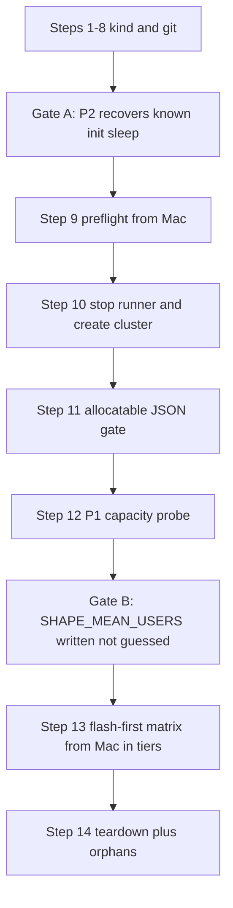

# Phase 5: measurement run (trace shapes, three arms, cold-start harvest)

Plan only. No cluster until every free gate below is green. Do not guess `SHAPE_MEAN_USERS`. Do not raise the AnyIO threadpool limiter from **40**.

Warm-up (settled): real Locust traffic at each shape’s **minimum plateau** for 5 minutes; `t0` after warm-up **and** after `spec_replicas == minReplicas`; published window is the following **18 minutes only**. If that assertion fails, abort the repetition (`WARMUP_TRIGGERED_SCALE`). Record end-of-warm-up CPU in the manifest.

**Approved corrections (C1–C3):** preflight from Mac before cluster create (`CPUS_ALL_REGIONS` + runner VM stopped); name the `FIRST_REQUEST_SERVED` image break; arm-level resume with **flash first**. **Cluster sizing:** `GKE_NUM_NODES=3`, `GKE_MACHINE_TYPE=e2-standard-4` (global **CPUS_ALL_REGIONS=12**; Google declined increase on usage-history grounds despite paid billing). Runner VM cannot run concurrently. Matrix runs from the **Mac** in tiers. **Throughput:** ~10.5 usable cores at ~0.1 core-seconds/request caps sustained load near **105 RPS**; realistic target **60–80 RPS** — below SLO-Scaler's 120–280 range (no parity claim). See [`RESULTS.md`](RESULTS.md) § Cluster sizing constraint.

---

## Evidence (quoted; else NOT FOUND)

### 1. `scripts/deploy_gke.sh` — cluster create and `.env` variables

`require_env` (must come from `.env` or flags; never gcloud config):

```35:39:scripts/deploy_gke.sh
load_env_file "${ENV_FILE}"
require_env PROJECT_ID
require_env REGION
require_env ZONE
require_env CLUSTER_NAME
require_env ARTIFACT_REGISTRY_REPO
```

Also read after `load_env_file` (defaults live in [`scripts/lib/gke_shape.sh`](scripts/lib/gke_shape.sh), overridable from `.env`): `NAMESPACE` (default `hpa-eval`), `GKE_MACHINE_TYPE`, `GKE_NUM_NODES`, `NODE_DISK_SIZE_GB`.

Create invocation:

```83:90:scripts/deploy_gke.sh
    gcloud container clusters create "${CLUSTER_NAME}" \
        --zone="${ZONE}" \
        --project="${PROJECT_ID}" \
        --machine-type="${MACHINE_TYPE}" \
        --num-nodes="${NUM_NODES}" \
        --disk-size="${NODE_DISK_SIZE_GB}" \
        --enable-ip-alias \
        --release-channel=regular
```

[`.env.example`](.env.example) documents only: `PROJECT_ID`, `REGION`, `ZONE`, `CLUSTER_NAME`, `ARTIFACT_REGISTRY_REPO`.

[`scripts/lib/gke_shape.sh`](scripts/lib/gke_shape.sh) defaults today:

```6:14:scripts/lib/gke_shape.sh
GKE_NUM_NODES="${GKE_NUM_NODES:-3}"
NODE_DISK_SIZE_GB="${NODE_DISK_SIZE_GB:-50}"
GKE_MACHINE_TYPE="${GKE_MACHINE_TYPE:-e2-standard-4}"
GKE_CPUS_PER_NODE=4
```

`GKE_CPUS_PER_NODE` is **not** derived from `GKE_MACHINE_TYPE`. Changing the machine type without changing this constant makes CPUS quota preflight lie.

### 2. Deployments — resources and probes

Both [`k8s/deployment-fixed.yaml`](k8s/deployment-fixed.yaml) and [`k8s/deployment-hpa.yaml`](k8s/deployment-hpa.yaml) currently:

- resources: request `cpu: "100m"` / `memory: "128Mi"`; limit `cpu: "200m"` / `memory: "256Mi"`
- `replicas: 3` (fixed), `replicas: 1` (hpa; HPA `minReplicas` is 3)
- probes identical:

```40:62:k8s/deployment-fixed.yaml
          startupProbe:
            httpGet:
              path: /health
              port: 8000
            periodSeconds: 5
            failureThreshold: 24
            timeoutSeconds: 1
          livenessProbe:
            httpGet:
              path: /health
              port: 8000
            initialDelaySeconds: 10
            periodSeconds: 10
            failureThreshold: 3
            timeoutSeconds: 2
          readinessProbe:
            httpGet:
              path: /health
              port: 8000
            initialDelaySeconds: 5
            periodSeconds: 5
            failureThreshold: 6
            timeoutSeconds: 1
```

### 3. [`k8s/hpa.yaml`](k8s/hpa.yaml) in full

```1:40:k8s/hpa.yaml
apiVersion: autoscaling/v2
kind: HorizontalPodAutoscaler
metadata:
  name: hpa-eval-hpa
  namespace: hpa-eval
  labels:
    app: hpa-eval
    experiment: hpa
spec:
  scaleTargetRef:
    apiVersion: apps/v1
    kind: Deployment
    name: hpa-eval-hpa
  minReplicas: 3
  maxReplicas: 10
  metrics:
    - type: Resource
      resource:
        name: cpu
        target:
          type: Utilization
          averageUtilization: 60
  behavior:
    scaleDown:
      stabilizationWindowSeconds: 60
      policies:
        - type: Percent
          value: 50
          periodSeconds: 60
    scaleUp:
      stabilizationWindowSeconds: 0
      policies:
        - type: Percent
          value: 100
          periodSeconds: 30
        - type: Pods
          value: 4
          periodSeconds: 30
      selectPolicy: Max
```

This `behavior:` block is the tuned arm. Kubernetes defaults (when `behavior` is omitted) are **scaleDown stabilization 300s**, **scaleUp policy periodSeconds 15**. That deviation is disclosed in [`RESULTS.md`](RESULTS.md) and unmeasured — the stock arm exists to measure it.

### 4. [`scripts/run_benchmark.sh`](scripts/run_benchmark.sh) — parsing, arm loop, `SHAPE_MEAN_USERS`

Argument parsing: `--env-file`, `--smoke`, `--repetitions`, `--run-id`, `--fixed-host`, `--hpa-host`, `--cold-start-only`, `--arm`, `--shape`.

```95:100:scripts/run_benchmark.sh
export SHAPE_MEAN_USERS="${SHAPE_MEAN_USERS:-45}"
if [[ "${SHAPE}" == "constant" || "${SHAPE}" == "wc98_constant" ]]; then
  HPA_NO_SCALE_POLICY="warn"
fi
```

Arm loop today is **fixed then hpa**, sequential, inside `run_one_repetition` (cold-start → 60s scrape pre-roll → Locust 18m → collect). There is **no** `hpa_stock` arm. `--arm` is only valid with `--cold-start-only`. `collect_metrics.py --mode` choices are `fixed` and `hpa` only.

### 5. Cold-start timing code

**Experiment cold-start (exists):** [`scripts/lib/cold_start.sh`](scripts/lib/cold_start.sh) — scale to 0, wait pods gone, scale to declared, `rollout status` (default 180s), `READY_REPLICAS_MATCH_DECLARED`. This is **not** a per-event waterfall.

**Scale-out waterfall collector:** **NOT FOUND** (no watch of HPA decisions, pod conditions, Pulled-event message parse, or first-request-served).

**First-request-served timestamp in the app:** **NOT FOUND**. [`app/main.py`](app/main.py) increments `app_requests_total` / `app_active_requests` but does not log a first-request ISO time.

**Scrape pre-roll (not Locust warm-up):** `METRICS_RATE_PREROLL_SEC` default **60** in [`scripts/lib/common.sh`](scripts/lib/common.sh). Idle scrape does not move `app_requests_total`; `rate()` at `t0` can still be empty.

### 6. [`HANDOFF.md`](HANDOFF.md) — runner VM and orphan cleanup

**Runner VM:** `bash scripts/provision_runner_vm.sh --env-file .env`; shape `e2-standard-4`, 50 GB disk, same `ZONE` as GKE; image builds stay on the Mac; tmux session `hpa-bench`; rsync results back.

**Orphan cleanup (after every GKE session and teardown):**

```157:165:HANDOFF.md
gcloud container clusters list --project=hpa-benchmark-2026
gcloud compute forwarding-rules list --project=hpa-benchmark-2026
gcloud compute target-pools list --project=hpa-benchmark-2026
gcloud compute firewall-rules list --project=hpa-benchmark-2026 \
  --filter="name~'^k8s-'"
gcloud compute disks list --filter="-users:*" --project=hpa-benchmark-2026
gcloud compute addresses list --project=hpa-benchmark-2026
```

`destructive_gke_teardown` **does not delete** the cluster; identity guard only.

HANDOFF cluster shape (`3 × e2-standard-2`, 100m/200m, maxReplicas 10) is **stale** relative to this phase.

### Other facts used below

- Threadpool **40**: documented in [`RESULTS.md`](RESULTS.md); do **not** change it. `active_requests` cannot show queueing past 40 in-flight `/cpu` calls per pod. Treat **40** as the saturation ceiling for that series.
- Histogram bucket columns: specified in [`docs/phase5-bucket-schema.md`](docs/phase5-bucket-schema.md), **NOT IMPLEMENTED**.
- Prometheus GKE: PVC exists; `--storage.tsdb.retention.time=2h` still. Per-arm collection immediately after Locust is why 2h worked; keep collecting immediately after each arm.
- Locustfiles already expose `min_users()` = `min(_scaled_plateau_users())`.
- No `kubernetes` package in [`requirements-tooling.txt`](requirements-tooling.txt). Collector uses `kubectl ... --watch-only`, not a new dependency.
- Quota math: [`scripts/lib/preflight_gke_quota.py`](scripts/lib/preflight_gke_quota.py) checks **regional** SSD/CPUS/INSTANCES and **global** `CPUS_ALL_REGIONS`. Regional: `GKE_NUM_NODES * NODE_DISK_SIZE_GB` SSD, `GKE_NUM_NODES * GKE_CPUS_PER_NODE` CPUS. Global: cluster CPUs **plus any running VM CPUs** must fit `CPUS_ALL_REGIONS` (limit **12**). The Phase 3 runner VM (`hpa-bench-runner`, 4 vCPU) must be **STOPPED** before cluster create — preflight fails `RUNNER_VM_MUST_BE_STOPPED` if it is running. Google declined CPUS_ALL_REGIONS increase on usage-history grounds (billed spend $0 despite credits). Do not contact Sales or try another region.
- Resume today: **NOT FOUND**. [`scripts/run_benchmark.sh`](scripts/run_benchmark.sh) `main()` loops `rep=1..REPETITIONS` with no skip of completed `rep-*` dirs. A crash redoes work unless Phase 5 adds arm-level markers (Step 4 / Step 14).

Minimum unit-mean plateaus (from provenance JSON; warmup users = `max(1, round(min_unit * SHAPE_MEAN_USERS))` **after** P1):

| Shape | min(unit_mean_plateaus) |
|-------|------------------------:|
| `wc98_flash` | 0.44978376 |
| `wc98_ramp` | 0.53313463 |
| `wc98_constant` | 0.9515588 |
| `wc98_periodic` | 0.5198696 |
| `rr_periodic` | 0.23216038 |

**wc98_constant warmup is ~95% of mean.** P1 must size `U` so that **constant min-plateau load on `minReplicas` stays under the 60% HPA target**; otherwise every constant (and possibly ramp) repetition aborts at `t0`. Flash peak/mean **2.015** is what must still be able to scale.

---

## Sequencing (everything free before anything bills)



---

## Numbered steps

### Step 1 — Vendor Phase 5 workload manifests

**Files:** [`k8s/deployment-fixed.yaml`](k8s/deployment-fixed.yaml), [`k8s/deployment-hpa.yaml`](k8s/deployment-hpa.yaml), [`k8s/hpa.yaml`](k8s/hpa.yaml), new [`k8s/hpa-stock.yaml`](k8s/hpa-stock.yaml).

- Pod CPU/memory: request **500m / 128Mi** wait — user said **500m/1000m pods**. Interpret as CPU request **500m**, CPU limit **1000m**. Memory: **do not invent**. Keep current memory **128Mi / 256Mi** unless a later probe shows OOMKilled (then raise from evidence).
- Fixed `replicas: 4`. HPA deployment `replicas: 4` (match minReplicas so cold-start restores 4).
- [`k8s/hpa.yaml`](k8s/hpa.yaml): `minReplicas: 4`, `maxReplicas: 20`, keep existing `behavior:` (this **is** `hpa_tuned`).
- [`k8s/hpa-stock.yaml`](k8s/hpa-stock.yaml): **full vendored copy** of the same HPA **without** the `behavior:` key (Kubernetes defaults). Same `metadata.name: hpa-eval-hpa` so `kubectl apply` swaps tuned↔stock between arms. Do **not** patch a live object’s spec piecemeal.
- Do not change probe blocks unless calibration proves they hide stages.

**Verify:** `kubectl diff` / yaml: CPU 500m/1000m; HPA 4–20; stock file has no `behavior:`. **needs-review. GCP: no.**

### Step 2 — P2 cold-start collector + kind calibration (must pass before GKE)

**Files:** new [`scripts/lib/cold_start_events.py`](scripts/lib/cold_start_events.py) (watch consumer), new [`scripts/calibrate_cold_start_collector.sh`](scripts/calibrate_cold_start_collector.sh), new kind overlay with **initContainer `sleep 8`** (above the 1s condition floor), one log line in [`app/main.py`](app/main.py). No new pip dependency.

**Comparability break (name it, do not shrug it):** adding `FIRST_REQUEST_SERVED` changes the application under test. Phase 5 GKE image tag is `git rev-parse --short HEAD` at deploy ([`scripts/deploy_gke.sh`](scripts/deploy_gke.sh)). Prior published runs used a different short SHA (read from each run’s `results/gke-deploy-manifest.json` / deploy logs — do not invent). Record both tags in [`RESULTS.md`](RESULTS.md) measurement limitations (Step 6 / Step 16). The effect is one log line once per process; the project still names the break.

**Once per process, not per request, not on the hot path:** module-level flag (or `threading.Event`), default unset. On the **first** HTTP request that enters the process (prefer the ASGI/Starlette middleware or `/` handler — **not** inside `compute_primes`, **not** after `ACTIVE_REQUESTS.inc()` on `/cpu`), emit one line to stderr (`FIRST_REQUEST_SERVED ts=... pod=...`) and set the flag. Every later request sees a true flag and does **no I/O**. A per-request log is a defect.

Passive watches (subprocess `kubectl ... --watch-only -o json`, not polling loops):

- HPA: `kubectl get hpa --watch-only` plus Events `reason=SuccessfulRescale` (decision time).
- Pods: `kubectl get pods --watch-only` for `metadata.creationTimestamp`, conditions `PodScheduled`, `PodReadyToStartContainers` (v1.28+; cluster 1.35), `ContainersReady`, `Ready`. Condition times are RFC3339 **whole seconds**. Deltas **&lt;1s** print as `<1s`. Never interpolate.
- Events: `kubectl get events --watch-only`. Image pull duration: **parse Pulled message text** (e.g. `Successfully pulled image X in 719ms`). Event `lastTimestamp` is not the duration. Missing event → `MISSING`.
- `image_cached`: true if message indicates already present / pulled in ~0ms / no pull; false if a pull duration was parsed; `MISSING` if neither.
- First request served: parse `FIRST_REQUEST_SERVED` from `kubectl logs --follow` on the new pod. If no line before timeout → `MISSING`.

One JSONL row per scale-out (replica increase). Schema fields: hpa_decision, pod_created, PodScheduled, PodReadyToStartContainers, image_pull_start, image_pull_end, image_pull_duration_ms (from message), container_started, ContainersReady, Ready, first_request_served, image_cached. Any absent stage is the string `MISSING`.

**Calibration (kind, not GKE):** apply initContainer `sleep 8`; trigger scale 1→2 (or 0→1) with image **already on the node** so pull is cached; collector must recover init/sleep-dominated interval within **1s floor** of 8s (accept 8s or 9s given whole-second conditions). If it cannot, **stop** — do not harvest GKE events.

**Verify:** `CALIBRATION_RECOVERED expected_sec=8 observed_sec=...` within 1s; a second run with image deleted (`image_cached=false`) still records `MISSING` not guesses for absent stages. **needs-review. GCP: no. safe-unattended: no.**

### Step 3 — Histogram bucket columns (specified, unimplemented)

**Files:** [`analysis/collect_metrics.py`](analysis/collect_metrics.py), [`analysis/metrics_contract.py`](analysis/metrics_contract.py) — follow [`docs/phase5-bucket-schema.md`](docs/phase5-bucket-schema.md) exactly. Register seven `latency_le_*_count` columns as rate-derived. `MISSING` when Prom is empty. Extend `--mode` later in Step 4 if stock needs a distinct Prometheus label; sequential stock/tuned on `experiment=hpa` can keep `--mode hpa` with different output filenames.

**Verify:** unit/smoke: serving row with Prom data gets integers; UNAVAILABLE rows `TARGET_UNAVAILABLE`; no fabricated zeros. **needs-review. GCP: no.**

### Step 4 — Three-arm runner, warm-up, t0 assertion

**Files:** [`scripts/run_benchmark.sh`](scripts/run_benchmark.sh), new [`scripts/run_phase5_matrix.sh`](scripts/run_phase5_matrix.sh), [`scripts/lib/locust_run.sh`](scripts/lib/locust_run.sh). Prefer **two Locust invocations** so `LoadTestShape` 18m plateaus stay byte-comparable to Phase 4 curves: (1) 5m at `min_users()`, (2) 18m full shape. Do not fold 5m into the shape vector.

**Resume unit = arm** (not shape, not mid-Locust). Complete means `rep-<n>/<arm>/STATUS` is `PASS` **and** required CSVs exist (`locust_*_stats.csv`, `*_metrics.csv`, `t0_*.txt`). In-progress or FAIL arm: do not reuse partial CSVs; delete that arm directory and rerun that arm only. `run_benchmark.sh` today has no skip (quoted above); this step adds skip-if-PASS. A shape is complete when all planned reps × three arms are PASS. The matrix driver walks shapes in the flash-first order (Step 14) and skips complete arms.

Per repetition, order:

1. `hpa_tuned`: apply [`k8s/hpa.yaml`](k8s/hpa.yaml); cold-start HPA deploy; scrape pre-roll; **warm-up Locust**; read `spec_replicas` and `cpu_utilization_pct` (or `kubectl top` / Prom); **if `spec_replicas != minReplicas` → `WARMUP_TRIGGERED_SCALE` abort**; write `warmup_cpu_utilization_pct` into manifest; set `t0`; start collector watch; 18m Locust; collect `hpa_tuned_metrics.csv`.
2. `hpa_stock`: apply [`k8s/hpa-stock.yaml`](k8s/hpa-stock.yaml); same sequence; `hpa_stock_metrics.csv`.
3. `fixed`: no HPA; same warm-up + assertion against declared replicas 4; `fixed_metrics.csv`.

`HPA_NO_SCALE_POLICY`: `warn` for `wc98_constant`, `abort` otherwise — **during the 18m window**, not during warm-up. Warm-up scale is always abort (`WARMUP_TRIGGERED_SCALE`).

Assert `spec_replicas == minReplicas` at `t0` on HPA arms. Start the waterfall collector **before** the 18m Locust so the first scale-out is captured.

**Verify:** kind or local: warm-up users logged as `WARMUP_USERS=min_users()`; `t0` after warm-up; named abort if replicas moved. **needs-review. GCP: no.**

### Step 5 — Cluster shape constants (still free)

**Files:** [`scripts/lib/gke_shape.sh`](scripts/lib/gke_shape.sh), comments in [`HANDOFF.md`](HANDOFF.md) expected-spend table (update numbers only after this phase’s shape is set).

Set defaults: `GKE_NUM_NODES=3`, `GKE_MACHINE_TYPE=e2-standard-4`, `GKE_CPUS_PER_NODE=4`, keep `NODE_DISK_SIZE_GB=50`.

**Verify:** regional preflight **150 SSD / 12 CPUS** (3×50, 3×4). Global `GKE_QUOTA_CPUS_ALL_REGIONS required=12` against limit **12** with runner VM **stopped**. **needs-review. GCP: no** (constant change only).

### Step 6 — Document threadpool 40 and the Phase 5 image break

**Files:** [`RESULTS.md`](RESULTS.md) measurement-limitations only. No AnyIO code change.

- Threadpool limiter remains **40**; that is the `active_requests` saturation ceiling.
- **Comparability:** Phase 5 runs an app image with one added `FIRST_REQUEST_SERVED` log line (once per process, off the `/cpu` hot path). Prior calibrated runs do not. Quote **image_tag** for Phase 5 from `results/gke-deploy-manifest.json` after deploy; quote prior tags from existing deploy manifests / run artifacts (`PROGRESS.md` notes that file records `image_tag`). If a prior tag file is absent, write `MISSING`, do not guess.

**Verify:** grep limiter 40; limitations paragraph names both tags or `MISSING`. **safe-unattended. GCP: no.**

### Step 7 — Kind wiring smoke (harness, not 18m×54)

**Files:** [`scripts/smoke_test.sh`](scripts/smoke_test.sh) — new checks: collector calibration (Step 2), `hpa-stock.yaml` apply/revert, `WARMUP_TRIGGERED_SCALE` negative test if feasible, `--resume` skips a planted PASS arm.

**Verify:** `--check` list includes the new names; `--full` still passes. **needs-review. GCP: no.**

### Step 8 — Gate A (stop if red)

P2 calibration recovered known 8s sleep. Bucket columns present. Three-arm runner exists. Manifests 4–20 / 500m–1000m. Arm-level PASS skip exists. **GCP: no.**

---

### Step 9 — Preflight from Mac (no cluster yet)

**GCP: yes.** On the Mac: `bash scripts/preflight.sh --env-file .env --require-gke`

Expect:

- `GKE_QUOTA_CPUS ... required=12 status=PASS` (regional us-central1)
- `GKE_QUOTA_SSD_TOTAL_GB ... required=150 status=PASS`
- `GKE_QUOTA_CPUS_ALL_REGIONS ... required=12 status=PASS` (global; runner VM **stopped**)
- No `RUNNER_VM_MUST_BE_STOPPED` error

If `hpa-bench-runner` is **RUNNING**, preflight fails — stop it before proceeding:

```bash
gcloud compute instances stop hpa-bench-runner --zone="${ZONE}" --project="${PROJECT_ID}"
```

**needs-review.**

### Step 10 — Stop runner VM and create cluster

**GCP: yes.** Only after Step 9 PASS.

1. Confirm runner VM is **TERMINATED** (not merely idle — stopped).
2. Image build on Mac (`docker build --platform linux/amd64`).
3. `bash scripts/deploy_gke.sh --env-file .env`

Do **not** start the runner VM for Phase 5 — global `CPUS_ALL_REGIONS=12` cannot fit cluster + runner.

**needs-review** (create).

### Step 11 — Allocatable gate (before sizing trust)

**GCP: yes.** `kubectl get node -o json` → record per-node `status.allocatable.cpu` and `.memory` (not `capacity`). Compute schedulable after daemonsets.

Peak **requests** if fixed (4) and HPA (20) overlap: `20 × 500m + Prometheus 100m` on ~10.5 usable cores per node aggregate.

**Verify:** log `NODE_ALLOCATABLE cpu=... memory=...`; abort `NODE_ALLOCATABLE_INSUFFICIENT` if 20 × 500m plus system cannot schedule. **needs-review.**

### Step 12 — P1 capacity probe (sets `SHAPE_MEAN_USERS`; not a benchmark)

**Implemented:** [`scripts/run_capacity_probe.sh`](scripts/run_capacity_probe.sh), [`scripts/lib/capacity_probe_derive.py`](scripts/lib/capacity_probe_derive.py). Smoke: `bash scripts/smoke_test.sh --check capacity-probe-derive`. Matrix requires `results/capacity_probe/derivation.json` (see C2 in P1 plan).

**GCP: yes.** First load on the new cluster. **Fixed arm only**, 4 replicas, 500m/1000m. No HPA.

**Wall-clock cap: 12 minutes.** Named error `CAPACITY_PROBE_TIMEOUT` if the stop rule is not met.

**Procedure:**

1. Locust against fixed LB, `wait_time` unchanged (`between(1,3)`), same `/cpu?intensity=low` mix.
2. Start at a small user count (e.g. 20). Every **45s**, add a step of users. Record per step: locust `user_count`, locust RPS (from stats, not guessed), mean `cpu_utilization_pct` of ready fixed pods (Prom or metrics-server — quote the source in the probe log).
3. **Stop at the first step where median pod CPU is ≥ 80% of the 1000m limit** (i.e. saturating the cgroup) **or** RPS per user falls vs the previous step (generator no longer getting more work). Do not continue to an 18-minute hold. This rule is pod-local on the fixed arm; it does not assume a user count from a larger cluster design. Saturation may arrive at a lower Locust user count on a 3-node cluster; the stop rule still fires on that step.
4. From the last **pre-saturation** step, compute `rps_per_user` and `cpu_per_rps` from those observed series only.

**Derivation of `U = SHAPE_MEAN_USERS` (integer; write the arithmetic into `results/capacity_probe/…`, no backfill):**

Let `cpu_req = 0.5` cores, `hpa_target = 0.60`, `min_rep = 4`.

Target cores at floor: `4 × 0.5 × 0.60 = 1.2` cores cluster-wide at the HPA metric.

`U` is the **largest integer** such that:

- Warm-up for **wc98_constant** (`round(0.9515588 × U)` users) produces estimated CPU **&lt; 60% of request** at 4 replicas (so `t0` assertion can pass).
- Peak for **wc98_flash** (`round(2.015377 × U)` users) produces estimated CPU **&gt; 60% of request** at 4 replicas (so flash can scale).

If those two inequalities cannot hold together from the measured `cpu_per_rps × rps_per_user`, **stop and report** — do not pick a compromise in silence.

Export `SHAPE_MEAN_USERS=$U` on the Mac. Compute and log per-shape `WARMUP_USERS=max(1, round(min_unit * U))` (still a function of `U`, not a hardcoded table).

**Verify:** probe log has per-step RPS and CPU; `SHAPE_MEAN_USERS=` one integer; constant-warmup vs flash-peak inequalities shown. **needs-review. Duration: ≤12 min.**

### Step 13 — Gate B then measurement matrix (flash first; from Mac; resumable)

**GCP: yes.** Cluster hours dominate cost. **Locust runs on the Mac** (California → us-central1). The Phase 3 runner VM is not used.

**Laptop sleep guard.** Wrap every long matrix invocation so macOS sleep cannot kill Locust mid-arm:

```bash
caffeinate -i bash scripts/run_phase5_matrix.sh --env-file .env --resume
```

`caffeinate -i` prevents idle sleep for the duration of the child process. Run each **tier** in a separate `caffeinate -i` invocation so a crash in one tier does not block the next.

**Tiers (flash first, then coverage shapes):**

| Tier | Shape | n | Arms | 18m windows | Notes |
|-----:|-------|--:|------|-------------:|-------|
| 1 | `wc98_flash` | 6 | 3 | 18 | Headline claim; complete before tier 2 |
| 2 | `wc98_ramp` | 3 | 3 | 9 | Coverage |
| 3 | `wc98_constant` | 3 | 3 | 9 | Coverage; `HPA_NO_SCALE_POLICY=warn` |
| 4 | `wc98_periodic` | 3 | 3 | 9 | Coverage |
| 5 | `rr_periodic` | 3 | 3 | 9 | Coverage |

**54** Locust 18m windows total. Sequential within each tier. ~27 min/arm × 54 ≈ **24.3 h** plus P1 and deploy.

**Partial matrix is analysable.** Publish whatever PASS arms exist. If flash n=6 all three arms are COMPLETE, Wilcoxon/medians for flash may be published while other shapes are `MISSING` or PARTIAL.

**Resume unit = arm.** Marker: `results/runs/<run_id>/rep-<n>/<arm>/STATUS` (`PASS` only if CSVs present). Driver: [`scripts/run_phase5_matrix.sh`](scripts/run_phase5_matrix.sh) `--resume` skips PASS arms, reruns the first incomplete arm, then continues the flash-first sequence.

**Operator returning after a drop:**

1. Check completeness:

```bash
find results/runs -name STATUS -print -exec cat {} \;
ls -d results/runs/run-*-wc98_flash/rep-*/{hpa_tuned,hpa_stock,fixed} 2>/dev/null
```

2. Remove incomplete arm directories only; resume with:

```bash
caffeinate -i bash scripts/run_phase5_matrix.sh --env-file .env --resume
```

(`SHAPE_MEAN_USERS` must still be the P1 value in the environment; do not silently revert to 45.)

Collector JSONL per arm. `image_cached` on every event.

**needs-review** — Mac must stay awake (`caffeinate -i`); expect ~24 h wall clock across tiers.

### Step 14 — Teardown and orphans

**GCP: yes.** Delete cluster (operator `gcloud container clusters delete` with project+name check). Run HANDOFF orphan list. Runner VM: leave running only if a follow-up is scheduled; otherwise delete.

**needs-review.**

### Step 15 — RESULTS

**Files:** [`RESULTS.md`](RESULTS.md). No fabricated cells. `MISSING` stays `MISSING`. Cold-start table uses `<1s` / `MISSING` / parsed ms. Three-arm comparison is the `behavior:` confound measurement. Threadpool 40. Capacity-probe artifact for `SHAPE_MEAN_USERS`. Named image-tag comparability break (Step 6). Partial-matrix rule: flash n=6 may stand alone.

**needs-review. GCP: no.**

---

## Cluster hours and cost (estimate, not billed)

Arm wall ≈ 54 × 27 min ≈ **24.3 h** plus ≤0.5 h deploy/P1 ≈ **~25 h** cluster.

Compute: **e2-standard-4 ~$0.134/node-hr** (2× e2-standard-2 ~$0.067/hr, us-central1 on-demand, not a live price fetch). **3 nodes ≈ $0.40/hr × 25 h ≈ $10** cluster compute. Two LoadBalancers **~$0.025/hr each** → **~$1.25**. Runner VM stopped during run (no concurrent cost).

**Ballpark ~$11–13** at those rates. **NOT FOUND** as a live Cloud Billing quote.

---

## Non-steps

- Do not edit frozen [`locust/locustfile.py`](locust/locustfile.py) / synthetic constant/flash locustfiles.
- Do not raise AnyIO 40.
- Do not interpolate sub-second pod conditions.
- Do not guess `SHAPE_MEAN_USERS` in git before Step 12.
- Do not run the 54-arm matrix if Step 2 calibration fails.
- Do not add `kubernetes` pip unless Step 2 proves kubectl watch drops events; if added, state why.
- Do not create the cluster before Step 9 preflight PASS from the Mac with runner VM stopped.
- Do not start the runner VM concurrently with the GKE cluster (global CPUS_ALL_REGIONS=12).
- Do not run the 54-arm matrix without `caffeinate -i` on the Mac.
