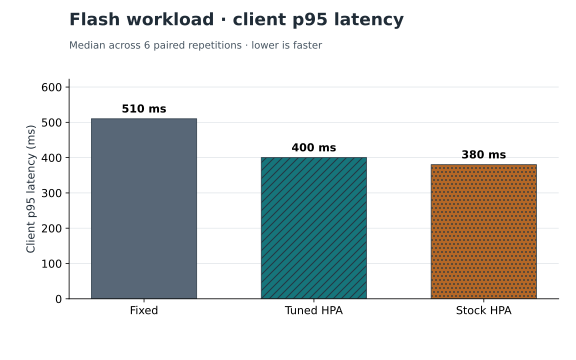
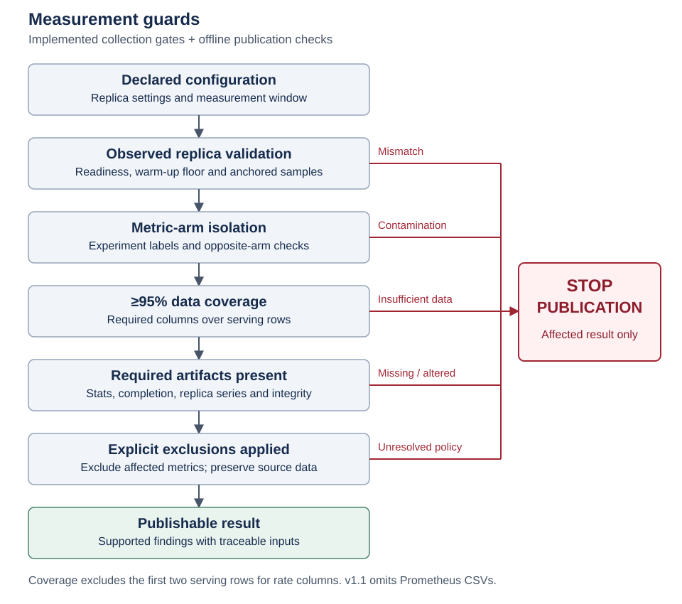
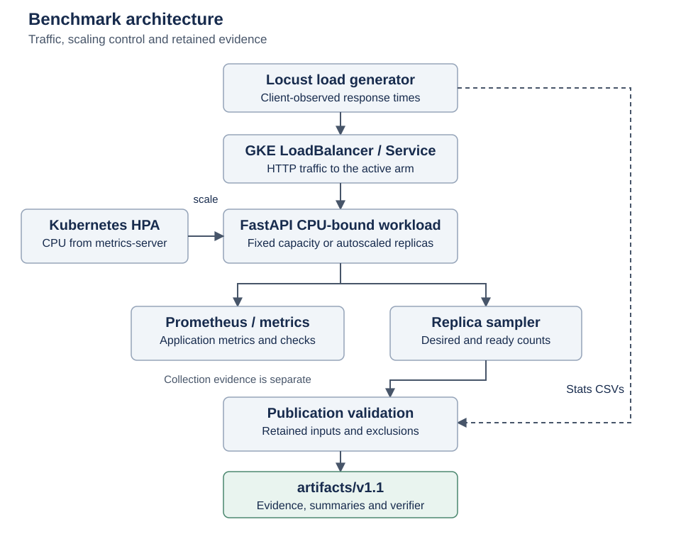
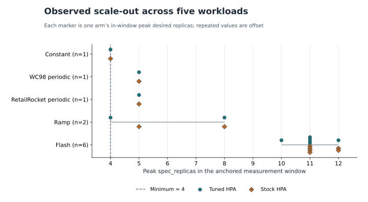
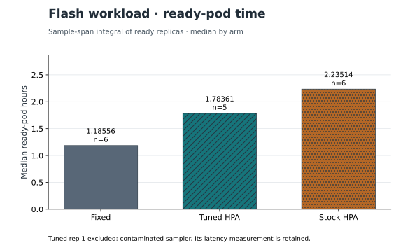
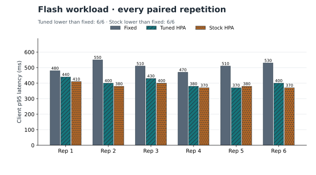

# Kubernetes Autoscaling Benchmark

[](https://github.com/smadduri9/k8s-hpa-benchmark/actions/workflows/ci.yml) [](LICENSE)

## When does Kubernetes Horizontal Pod Autoscaling actually help?

A controlled Google Kubernetes Engine benchmark comparing fixed capacity, stock Kubernetes Horizontal Pod Autoscaler (HPA), and tuned HPA using traffic shapes derived from real HTTP access logs and retail event traces.

HPA adjusts the number of application replicas as demand changes. Here it watches CPU utilization: adding replicas can reduce request delays, while keeping those replicas ready uses more capacity over time.

## Key results

<!-- BEGIN V1.1 GENERATED FINDINGS -->

**Flash workload · 6 paired repetitions · median client p95**

| Fixed capacity | Tuned HPA | Stock HPA |
|---:|---:|---:|
| **510 ms** | **400 ms** | **380 ms** |

Tuned HPA beat fixed in **6/6** repetitions. Stock HPA beat fixed in **6/6** repetitions.

<!-- END V1.1 GENERATED FINDINGS -->



Both HPA configurations lowered flash-workload latency. The evidence does not establish that tuning improved on stock HPA.

[Technical report](RESULTS.md) · [Verify the evidence](REPRODUCE.md#verify-published-results) · [Failure investigation](POSTMORTEM.md)

## What was tested

The same FastAPI CPU-bound application ran under three capacity policies. Each measured arm lasted 18 minutes, following a separate warm-up.

| Policy | Declared replicas | CPU target | Scaling behavior |
|---|---|---|---|
| Fixed | 4 | None | Static capacity |
| Stock HPA | 4–12 | 60% of CPU request | Kubernetes defaults |
| Tuned HPA | 4–12 | 60% of CPU request | Explicit scale-up policies and 60-second scale-down stabilization |

Application pods request 500m CPU and have a 1000m limit. Load comes from WorldCup98 and RetailRocket trace-derived user-count envelopes. The retained scope contains 33 completed arms across five workloads. See the [declared configuration](artifacts/v1.1/metadata/runs.json) and [HPA manifests](k8s/).

## Why this project changed direction

The original benchmark reported a dramatic failure-rate improvement. Verification later found that the supposedly three-replica fixed baseline had actually been running with one replica. That invalidated the comparison, and the result was withdrawn.

The measurement system was rebuilt to reject mismatched replica observations, mixed-arm metrics and incomplete runs. The project now pairs each supported finding with retained inputs and an offline verifier. The [postmortem](POSTMORTEM.md) explains the original failure and a later unequal-floor comparison.

## Measurement safeguards



Failed checks stop the affected result from being published. Missing measurements stay `MISSING`; exclusions apply to the affected metric explicitly.

The diagram combines implemented collector gates and publication checks. The v1.1 package verifies retained artifacts, exclusions and calculations; it omits Prometheus CSVs and cannot certify historical coverage outcomes. [Guard implementation and scope](docs/MEASUREMENT_GUARDS.md) explains that boundary, including the serving-row coverage denominator and workload-specific no-scale policy.

## Architecture



Client latency comes from Locust. HPA uses metrics-server CPU measurements; Prometheus and the replica sampler provide separate observations for collection and analysis.

## Workload behavior



Flash traffic produced the strongest scale-out. Periodic workloads moved only one replica above the minimum, constant traffic did not scale, and ramp behavior varied across repetitions.

<!-- BEGIN V1.1 GENERATED SCALING -->

| Workload | Observed HPA peak replicas | Repetitions |
|---|---:|---:|
| Constant | 4 | 1 |
| WC98 periodic | 5 | 1 |
| RetailRocket periodic | 5 | 1 |
| Ramp | 4–8 | 2 |
| Flash | 10–12 | 6 |

<!-- END V1.1 GENERATED SCALING -->

The floor was 4 replicas. These are observed in-window peaks of desired replicas, not ready-replica counts. Non-flash samples are descriptive. Trace windows become 30-second user-count plateaus; periodic windows compress 24 hours into 18 minutes. Individual source arrivals are not replayed. [Workload methodology](RESULTS.md#trace-derived-load-shapes)

## Resource tradeoff



Lower flash latency came with more ready-pod time: the integral of ready replicas over sampled time, expressed in pod-hours. This measures provisioned readiness over time; it does not measure CPU usage or billing.

<!-- BEGIN V1.1 GENERATED RESOURCES -->

| Policy | Median ready-pod time | Repetitions | Ratio of medians vs fixed |
|---|---:|---:|---:|
| Fixed | 1.18556 pod-hours | 6 | Reference |
| Tuned HPA | 1.78361 pod-hours | 5 | +50.445% |
| Stock HPA | 2.23514 pod-hours | 6 | +88.531% |

<!-- END V1.1 GENERATED RESOURCES -->

One tuned repetition is excluded from ready-pod time because its replica series extends beyond the benchmark window. Its latency remains included. The source CSV is preserved unchanged and the [exclusion is executable](artifacts/v1.1/exclusions.csv).

## Technical findings



Both HPA arms had lower client p95 than fixed in every retained flash repetition. The stock-versus-tuned difference is less conclusive.

<!-- BEGIN V1.1 GENERATED TESTS -->

| Flash comparison | Exact two-sided Wilcoxon p |
|---|---:|
| Fixed vs tuned HPA | 0.03125 |
| Fixed vs stock HPA | 0.03125 |
| Tuned vs stock HPA | 0.09375 |

<!-- END V1.1 GENERATED TESTS -->

Tests are unadjusted and arm order was fixed. The tuned-versus-stock result establishes neither equivalence nor a tuning benefit. Client p95 includes failures and both workload endpoints; each headline is a median of run-level p95 values.

Ramp scale-out varied across two repetitions. Paired hardware inventories and warm-up CPU comparisons are `MISSING`, so the evidence cannot attribute that variation to CPU generation. [Detailed findings and limitations](RESULTS.md)

## Reproduce / verify

No cloud is needed to reproduce the headline calculations. From the repository root, with Python 3.14 installed:

```bash
export REPO_ROOT="$PWD"
python3 -m venv .venv
"${REPO_ROOT}/.venv/bin/python" -m pip install -r requirements-tooling.txt
"${REPO_ROOT}/.venv/bin/python" -B artifacts/v1.1/verify.py
"${REPO_ROOT}/.venv/bin/python" -B -m unittest discover -s tests -p test_publication.py
```

The verifier checks package integrity and recomputes medians, paired tests, ready-pod time and replica peaks. The tests exercise calculations and rejection of altered or incomplete evidence. [REPRODUCE.md](REPRODUCE.md) includes the pytest command, figure regeneration and a separate GKE rerun path. The original cloud cluster was deleted.

## Repository map

| Path | Purpose |
|---|---|
| [app/](app/) | FastAPI benchmark application |
| [k8s/](k8s/) | Deployments, services, HPA and Prometheus manifests |
| [locust/](locust/) | Workload drivers and trace-derived shapes |
| [scripts/](scripts/) | Experiment orchestration and publication tooling |
| [analysis/](analysis/) | Collection, metric contracts and analysis utilities |
| [artifacts/v1.1/](artifacts/v1.1/README.md) | Public evidence, exclusions, summaries and verifier |
| [docs/](docs/README.md) | Methodology, figures and existing website |
| [tests/](tests/) | Publication verification tests |
| [docs/archive/](docs/archive/README.md) | Historical results and development records |

## Limitations

- Six flash repetitions support the main comparison. Ramp has two; each other workload has one. The planned non-flash matrix was not completed.
- One application, one cloud setup and fixed arm order limit generalization. New deployments may produce different performance.
- Load ran from an external client. Client latency includes the network path and queueing.
- The bundle does not establish a cold-start distribution, client SLO compliance, delivered arrival statistics or a hardware cause for variation.
- Hashes establish internal consistency, not independent attestation of the experiments. [Full limitations](RESULTS.md#measurement-limitations)

## Citation / release

**Release version: v1.1.0.** Use [CITATION.cff](CITATION.cff) for citation metadata. The [Zenodo concept DOI](https://doi.org/10.5281/zenodo.22697396) identifies all versions; it is not a version-specific v1.1.0 DOI. [Release history](https://github.com/smadduri9/k8s-hpa-benchmark/releases)

Code is [MIT licensed](LICENSE). Trace derivatives retain their [source terms](artifacts/v1.1/SOURCE_NOTICES.md), including CC BY-NC-SA 4.0 for RetailRocket-derived material.
