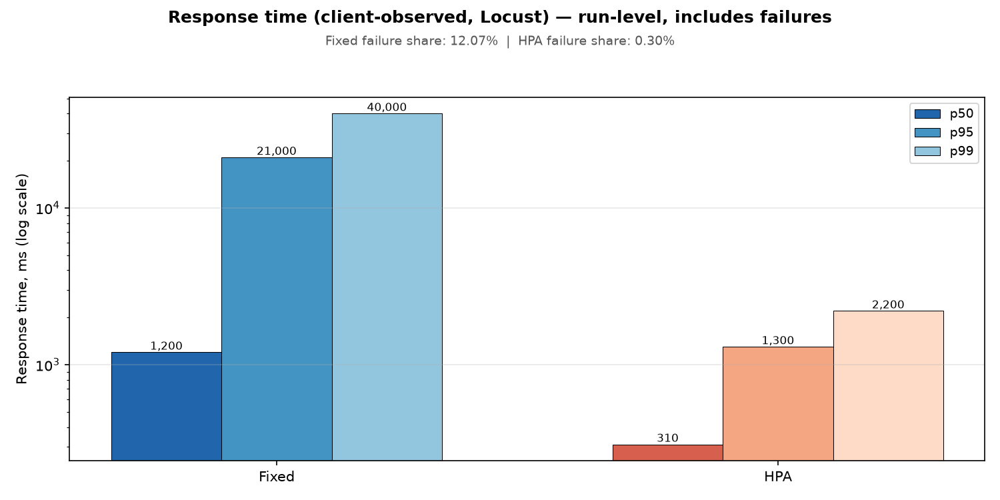
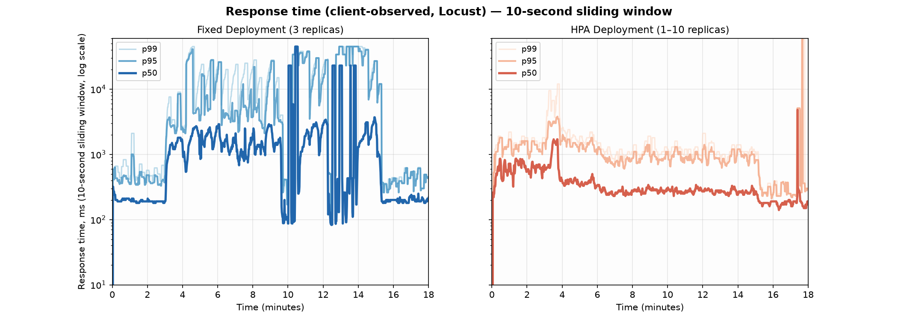
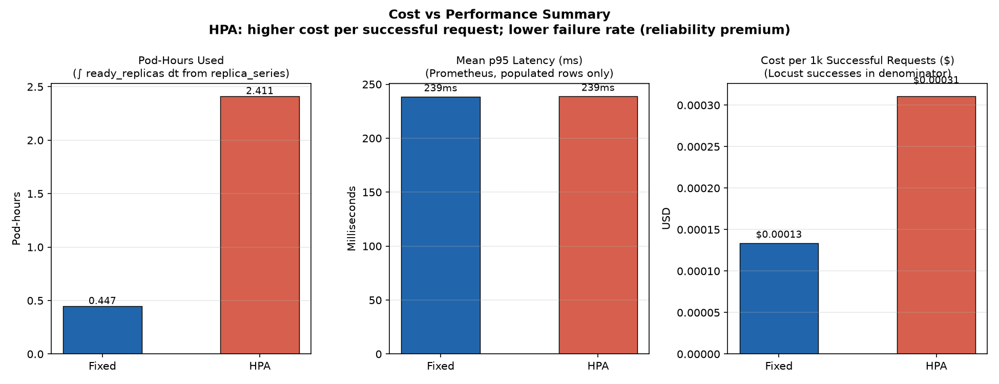

# k8s-hpa-benchmark

Personal benchmark project that evaluates Kubernetes Horizontal Pod Autoscaler (HPA) behavior on bursty traffic patterns.

## Phase 5 results (measurement of record)

Published page: [smadduri9.github.io/k8s-hpa-benchmark](https://smadduri9.github.io/k8s-hpa-benchmark/). Full write-up and per-rep tables: [RESULTS.md](RESULTS.md#phase-5-findings-measurement-of-record).

<!-- BEGIN V1.1 GENERATED FINDINGS -->

Evidence and offline commands: [v1.1 package](artifacts/v1.1/README.md). Authority: [verify.py](artifacts/v1.1/verify.py) and [headline.json](artifacts/v1.1/summary/headline.json); the historical general aggregator does not apply the publication exclusions.

Trace-derived WorldCup98 and RetailRocket load; three arms (`fixed`, `hpa_tuned`, `hpa_stock`). `SHAPE_MEAN_USERS=69` is a model-derived calibration parameter, not measured maximum capacity. Declared HPA floor: 4 replicas.

### Finding 1. Flash latency and ready-pod time

Client p95 medians: fixed **510 ms**, tuned **400 ms**, stock **380 ms**, across **6 paired repetitions**. Tuned p95 was lower than fixed in 6/6; stock was lower in 6/6.

Exact two-sided Wilcoxon: fixed/tuned **p=0.031250**, fixed/stock **p=0.031250**, tuned/stock **p=0.093750**. These are unadjusted tests. The tuned/stock comparison does not establish equivalence or a benefit from tuning. Arm order was not randomized.

Median ready-pod hours: fixed **1.18556 (n=6)**, tuned **1.78361 (n=5)**, stock **2.23514 (n=6)**. Ratios of unrounded medians are **+50.445173%** tuned/fixed and **+88.530928%** stock/fixed. Ready-pod time measures ready replicas integrated over sampled time; it does not measure consumed CPU or billing.

[Exclusions policy](artifacts/v1.1/exclusions.csv): tuned flash rep-1 retains its latency measurement but is excluded from ready-pod time because its replica series spans beyond the benchmark window. The contaminated file is preserved unchanged; its historical process origin is not independently evidenced. See [per-repetition results](artifacts/v1.1/summary/flash_repetitions.csv) and [paired tests](artifacts/v1.1/summary/statistical_tests.csv).

### Finding 2. Workload coverage

Observed in-window peak `spec_replicas`, listed in repetition order:

| Workload | Repetitions | Tuned HPA | Stock HPA |
|---|---:|---|---|
| `wc98_flash` | 6 | 12, 11, 11, 11, 10, 11 | 11, 12, 12, 11, 11, 11 |
| `wc98_ramp` | 2 | 8, 4 | 8, 5 |
| `wc98_constant` | 1 | 4 | 4 |
| `wc98_periodic` | 1 | 5 | 5 |
| `rr_periodic` | 1 | 5 | 5 |

Fixed-arm peaks were 4 throughout this completed scope. Flash, ramp and both periodic workloads showed scale-out above the floor in at least one retained arm/repetition. Constant did not. These observations do not establish peak-to-mean ratio as a sufficient predictor of HPA engagement. Source: [replica peaks and request counts](artifacts/v1.1/summary/replica_peaks.csv).

### Finding 3. Ramp run/deployment sensitivity

Two ramp repetitions produced similar measured request counts (34,283 and 33,835 in the tuned arm) but different scale-out: tuned peaked at 8 replicas in one repetition and 4 in the other. The retained evidence does not establish a hardware-level cause. This is evidence of run/deployment sensitivity, not a causal CPU-platform finding. Paired warm-up CPU vectors and hardware inventories are `MISSING`.

Flash has six completed repetitions, ramp two, and each other workload one. The originally defined three-repetition scope for the non-flash workloads was not completed. Incomplete ramp rep-3 is excluded. The non-flash observations are descriptive, not a workload ranking.

<!-- END V1.1 GENERATED FINDINGS -->

No Phase 5 cold-start distribution is published; retained cold-start output is insufficient. See [limitations](RESULTS.md#measurement-limitations).

CI on GitHub Actions runs offline checks, including v1.1 verification, publication tests, generated-text consistency, Wilcoxon self-tests, metrics fixtures, quoting checks and analysis imports. Shape validation and the benchmark itself require a cluster.

Cite via [CITATION.cff](CITATION.cff). A Zenodo DOI is minted from a GitHub release. Steps are in [CONTRIBUTING.md](CONTRIBUTING.md#zenodo-archive-doi). GitHub Pages is the `docs/` directory on `main`. Enable it under Settings, Pages, Deploy from a branch, `main`, `/docs`.

## Calibrated results (minReplicas=3 both arms), superseded

**Superseded by Phase 5** (synthetic shapes, two arms, `minReplicas=3`). Tables below are historical and are not covered by the v1.1 verifier; their raw run evidence is not bundled for public verification. Full write-up: [RESULTS.md](RESULTS.md#calibrated-results-minreplicas3-both-arms-superseded). SLO and error-budget analysis: [RESULTS.md § SLO](RESULTS.md#slo-and-error-budget-calibrated-runs); incident write-up: [POSTMORTEM.md](POSTMORTEM.md); policy: [docs/error-budget-policy.md](docs/error-budget-policy.md).

### hybrid — `run-20260905T220046Z-hybrid` (n=6)

| Metric | Fixed (median) | HPA (median) | HPA slower | p (two-sided) |
|--------|---------------:|-------------:|-----------:|--------------:|
| client_p50_ms | 895 | 370 | 0/6 | 0.031250 |
| client_p95_ms | 3250 | 1950 | 0/6 | 0.062500 (n=5, one tie) |
| client_p99_ms | 4200 | 2800 | 1/6 | 0.062500 |
| failure_rate | 0.000124 | 0.000163 | — | 0.562500 (not significant) |
| pod_hours | 0.890417 | 2.493750 | — | 0.031250 |
| cost_per_1k | 0.000147246 | 0.000339106 | — | 0.031250 |

`P_FLOOR n=6 min_attainable_two_sided_p=0.031250` — p=0.031250 is the floor at n=6, not a finer significance claim.

### constant — `run-20260906T050515Z-constant` (n=3)

| Metric | Fixed (median) | HPA (median) | HPA slower | p (two-sided) |
|--------|---------------:|-------------:|-----------:|--------------:|
| client_p50_ms | 450 | 270 | 0/3 | 0.250000 |
| client_p95_ms | 1500 | 1100 | 0/3 | 0.250000 |
| client_p99_ms | 2100 | 1600 | 0/3 | 0.250000 |
| failure_rate | 0 | 0.00010008 | — | 0.250000 |
| pod_hours | 0.891667 | 2.723060 | — | 0.250000 |
| cost_per_1k | 0.000125359 | 0.000363458 | — | 0.250000 |

`P_FLOOR n=3 min_attainable_two_sided_p=0.250000` — every p-value in this table is the floor at n=3; no row can reach significance by construction.

### flash — `run-20260906T201803Z-flash` (n=2 of 3)

**STATUS: PARTIAL** — 2 of 3 repetitions executed; rep-3 never started. rep-2's Prometheus-derived cells are all `MISSING` because the TSDB was wiped before recovery. Locust data is valid. No aggregates published in this pass.

## Superseded — run-20260904T230444Z

This was the published headline. It is not a fair comparison: HPA ran at `minReplicas=1` while the fixed arm was declared at 3. Superseded by the calibrated minReplicas=3 runs above. The historical table and figures remain for context; their raw run evidence is not bundled for public verification.

**Status: PARTIAL** — fixed arm collapsed under burst; metrics gaps are measured, not hidden.

| Arm | Requests | Failures | Failure rate | Client p50 / p95 / p99 (ms) | Replicas | Source |
|-----|---------:|---------:|-------------:|----------------------------|----------|--------|
| **Fixed** (declared 3) | 10,193 | 1,230 | **12.07%** | **1,200 / 21,000 / 40,000** (12.07% failures) | ready hit **0** during collapse | `locust_fixed_stats.csv` |
| **HPA** (1–10) | 20,820 | 63 | **0.30%** | **310 / 1,300 / 2,200** (0.30% failures) | peak **spec=10**, peak **ready=10** | `locust_hpa_stats.csv` |

Client-observed response time includes queueing, connection setup, and failures (Locust). Prometheus in-handler service time (~239 ms mean p95) is a separate metric — see [RESULTS.md](RESULTS.md#latency--two-metrics-never-merged).

Fixed availability (73 rows): **14 UNAVAILABLE** / **40 DEGRADED** / **19 AVAILABLE**. HPA successful-request throughput **2.32×** fixed (20757 ÷ 8963). **Cost:** HPA **$0.000311** vs fixed **$0.000133** per 1k successful requests (**2.33×** premium) — reliability (0.30% vs 12.07% failures) at higher compute cost per success.

### Client-observed response time (Locust, run-level)



### Client-observed response time (10-second sliding window)



### Service time (in-handler, Prometheus)


### Throughput (RPS)


### CPU and replica count (HPA arm)


### Cost vs performance



These tracked historical figures are viewable, but their underlying run artifacts are private, gitignored inputs. They cannot be regenerated from the v1.1 package.

---

## Quick Start

See [HANDOFF.md](HANDOFF.md) for the full reproducible runbook.

**Smoke validation (kind, not performance-comparable to GKE):**
```bash
bash scripts/smoke_test.sh --check harness
bash scripts/smoke_test.sh --full
```

**GKE benchmark:**
```bash
bash scripts/preflight.sh --env-file .env --require-gke
nohup bash scripts/run_benchmark.sh --env-file .env --repetitions 1 > results/latest.nohup.log 2>&1 &
```

Prior committed artifacts were superseded to `superseded/sample_data-2026-03/` (see `DATA_PROVENANCE.md`).

## Overview

This project compares deployment strategies for the same FastAPI workload.

**Phase 5 (measurement of record):** static **4** replicas vs HPA **4–12** at 60% CPU, with a stock Kubernetes `behavior:` arm and a tuned `behavior:` arm, on trace-derived load.

**Phase 1 calibrated runs (superseded):** static **3** replicas vs HPA **3–10**, synthetic shapes.

The current publication reports client latency, ready-pod time and replica scaling. Historical cost-model outputs are superseded and are not billing measurements.

## Stack

- Kubernetes + HPA (`autoscaling/v2`)
- FastAPI workload service
- Locust phased load test
- Prometheus metrics collection
- Python analysis pipeline (NumPy + Matplotlib)
- GKE and Minikube deployment scripts

## Repository Layout

- `app/` FastAPI service and Docker image definition
- `k8s/` namespace, deployments, services, HPA, Prometheus manifests
- `locust/` workload generator with phased traffic shape
- `analysis/` metric collection and report plotting scripts
- `artifacts/v1.1/` self-contained Phase 5 evidence, exclusions and offline verifier
- `docs/` published figures and investigation tables for completed runs
- `scripts/` local and GKE deployment + experiment orchestration

## Tooling setup (required)

All analysis and Locust commands use the repo virtualenv — do not install tooling globally.

```bash
python3 -m venv .venv
".venv/bin/python" -m pip install -r requirements-tooling.txt
bash scripts/preflight.sh
```

## Quick Start (Local, Minikube)

```bash
bash scripts/preflight.sh
bash scripts/deploy_local.sh
```

Get service endpoint:

```bash
MINIKUBE_IP=$(minikube ip)
HPA_PORT=$(kubectl get svc hpa-eval-hpa-svc -n hpa-eval -o jsonpath='{.spec.ports[0].nodePort}')
export HPA_HOST="http://${MINIKUBE_IP}:${HPA_PORT}"
```

Run phased load test:

```bash
".venv/bin/locust" -f locust/locustfile.py --host "$HPA_HOST" --headless --run-time 18m
```

Collect and analyze metrics:

```bash
kubectl port-forward svc/prometheus 9090:9090 -n hpa-eval
".venv/bin/python" analysis/collect_metrics.py --mode fixed --prometheus-url http://localhost:9090
".venv/bin/python" analysis/collect_metrics.py --mode hpa --prometheus-url http://localhost:9090
".venv/bin/python" analysis/analyze_results.py
```

## Full GKE Run

```bash
bash scripts/deploy_gke.sh YOUR_PROJECT_ID us-central1
bash scripts/run_experiment.sh
```

## Reproducible Demo Path

If you do not want to provision a cluster immediately, generate synthetic benchmark data and plots:

```bash
".venv/bin/python" synthetic/generate_synthetic_data.py
".venv/bin/python" analysis/analyze_results.py
```

Synthetic data is quarantined and not comparable to measured GKE runs — see `DATA_PROVENANCE.md`.
