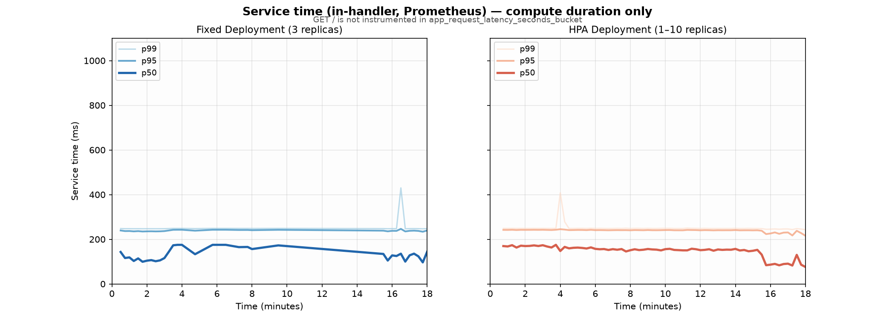
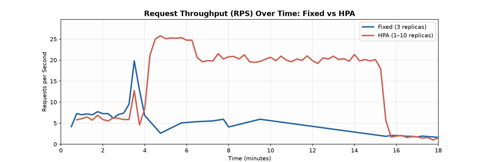
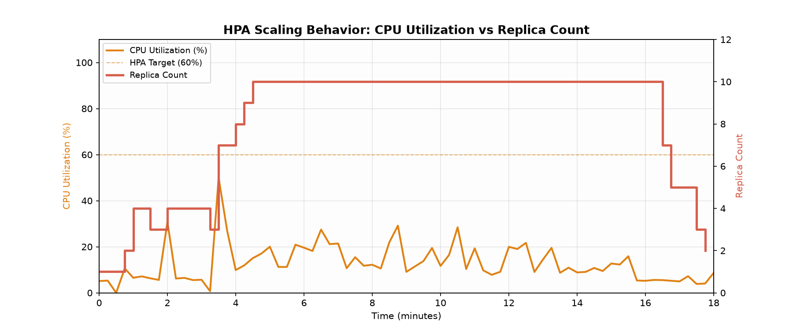
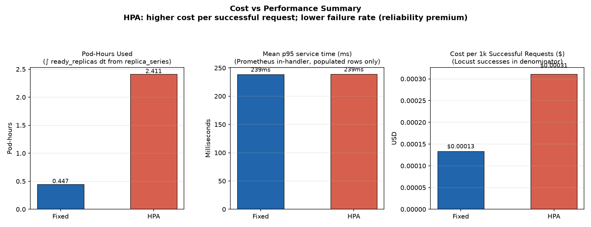

# Superseded results

Historical comparisons only. None of the tables or figures below supports the current publication. Raw inputs for these later historical runs are not bundled; these results cannot be regenerated from v1.1. Use the [current report](../../RESULTS.md) and [public evidence](../../artifacts/v1.1/README.md) for supported findings.

The original failure-rate claim was withdrawn after verification found a one-replica fixed baseline despite a declaration of three. A later run also had unequal declared floors. See the [postmortem](../../POSTMORTEM.md).

## Calibrated results (minReplicas=3 both arms), superseded

**Superseded by Phase 5** (synthetic shapes, two arms, `minReplicas=3`). Tables below are historical and are not covered by the v1.1 verifier; their raw run evidence is not bundled for public verification. Full write-up: [current report](../../RESULTS.md). SLO and error-budget analysis: [current report](../../RESULTS.md); incident write-up: [POSTMORTEM.md](../../POSTMORTEM.md); policy: [docs/error-budget-policy.md](../error-budget-policy.md).

### hybrid — `run-20260905T220046Z-hybrid` (n=6)

| Metric | Fixed (median) | HPA (median) | HPA slower | p (two-sided) |
|--------|---------------:|-------------:|-----------:|--------------:|
| client_p50_ms | 895 | 370 | 0/6 | 0.031250 |
| client_p95_ms | 3250 | 1950 | 0/6 | 0.062500 (n=5, one tie) |
| client_p99_ms | 4200 | 2800 | 1/6 | 0.062500 |
| failure_rate | 0.000124 | 0.000163 | — | 0.562500 (not significant) |
| pod_hours | 0.890417 | 2.493750 | — | 0.031250 |
| cost_per_1k | 0.000147246 | 0.000339106 | — | 0.031250 |

`P_FLOOR n=6 min_attainable_two_sided_p=0.031250` — p=0.031250 is the floor at n=6, not a finer significance claim.

### constant — `run-20260906T050515Z-constant` (n=3)

| Metric | Fixed (median) | HPA (median) | HPA slower | p (two-sided) |
|--------|---------------:|-------------:|-----------:|--------------:|
| client_p50_ms | 450 | 270 | 0/3 | 0.250000 |
| client_p95_ms | 1500 | 1100 | 0/3 | 0.250000 |
| client_p99_ms | 2100 | 1600 | 0/3 | 0.250000 |
| failure_rate | 0 | 0.00010008 | — | 0.250000 |
| pod_hours | 0.891667 | 2.723060 | — | 0.250000 |
| cost_per_1k | 0.000125359 | 0.000363458 | — | 0.250000 |

`P_FLOOR n=3 min_attainable_two_sided_p=0.250000` — every p-value in this table is the floor at n=3; no row can reach significance by construction.

### flash — `run-20260906T201803Z-flash` (n=2 of 3)

**STATUS: PARTIAL** — 2 of 3 repetitions executed; rep-3 never started. rep-2's Prometheus-derived cells are all `MISSING` because the TSDB was wiped before recovery. Locust data is valid. No aggregates published in this pass.

## Superseded — run-20260904T230444Z

This was the published headline. It is not a fair comparison: HPA ran at `minReplicas=1` while the fixed arm was declared at 3. Superseded by the calibrated minReplicas=3 runs above. The historical table and figures remain for context; their raw run evidence is not bundled for public verification.

**Status: PARTIAL** — fixed arm collapsed under burst; metrics gaps are measured, not hidden.

| Arm | Requests | Failures | Failure rate | Client p50 / p95 / p99 (ms) | Replicas | Source |
|-----|---------:|---------:|-------------:|----------------------------|----------|--------|
| **Fixed** (declared 3) | 10,193 | 1,230 | **12.07%** | **1,200 / 21,000 / 40,000** (12.07% failures) | ready hit **0** during collapse | `locust_fixed_stats.csv` |
| **HPA** (1–10) | 20,820 | 63 | **0.30%** | **310 / 1,300 / 2,200** (0.30% failures) | peak **spec=10**, peak **ready=10** | `locust_hpa_stats.csv` |

Client-observed response time includes queueing, connection setup, and failures (Locust). Prometheus in-handler service time (~239 ms mean p95) is a separate metric — see [current report](../../RESULTS.md).

Fixed availability (73 rows): **14 UNAVAILABLE** / **40 DEGRADED** / **19 AVAILABLE**. HPA successful-request throughput **2.32×** fixed (20757 ÷ 8963). **Cost:** HPA **$0.000311** vs fixed **$0.000133** per 1k successful requests (**2.33×** premium) — reliability (0.30% vs 12.07% failures) at higher compute cost per success.

### Client-observed response time (Locust, run-level)

### Client-observed response time (10-second sliding window)

### Service time (in-handler, Prometheus)

### Throughput (RPS)

### CPU and replica count (HPA arm)

### Cost vs performance

These tracked historical figures are viewable, but their underlying run artifacts are private, gitignored inputs. They cannot be regenerated from the v1.1 package.
